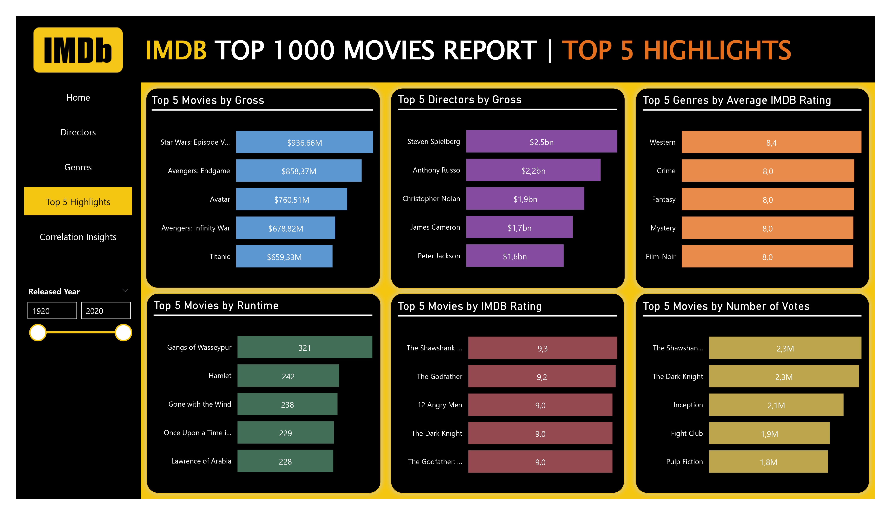
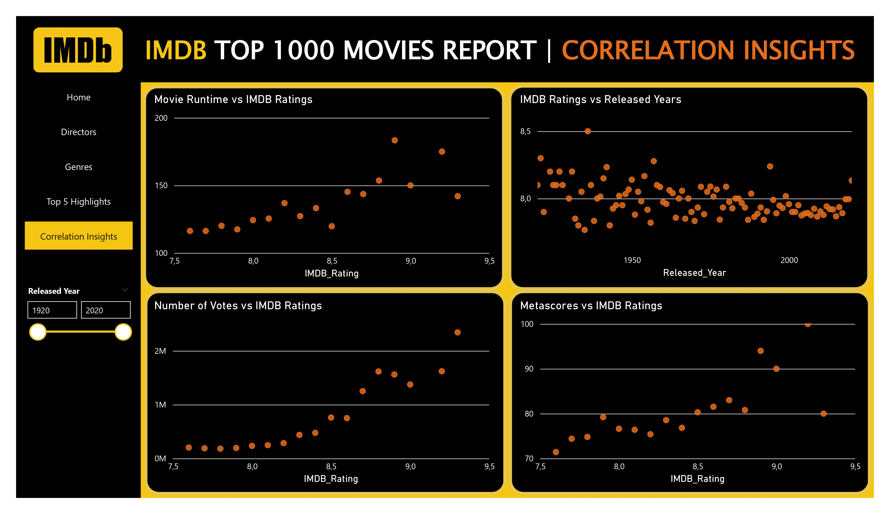

# IMDB Top 1000 Movies Analysis

 
 

## Introduction

In this project, I focused on analysis of IMDB Top 1000 Movies dataset sourced from Kaggle, using **Python** and **Power BI**.(The dataset source is end of the report.) I made the data transforming and cleaning operations utilizing the Pandas library in the Jupyter Notebook platform. Following this, I translated the refined data into visual representations by crafting an insightful dashboard in Power BI. The goals of this project were to explore the dataset, extract meaningful insgihts, unveil hidden pattern within the data, and comprehend the connections among the dataset by establishing correlation charts.

**It's important to note that** the dataset I utilized from Kaggle wasn't up-to-date, and as a result, the analysis outcomes may differ from the current Top 1000 Movies data in IMDB.

 

## Problem Statement

* How is the distribution of movie counts among different certificates ?
  
* How is the number of movies distributed among different directors? Additionally, what information is available about these movies, and what are the total gross, average runtime, average gross, average number of votes, and average IMDb rating and Metascore of the movies directed by these directors?
* How is the number of movies distributed among different genres? Additionally, what information is available about these movies, and what are the total gross, average runtime and average IMDb rating and Metascore of the movies belongs to these genres?
* What is the average gross for each genre?
* How is the distribution of movie counts among genres and directors ?
* Which movies rank in the top 5 in terms of the gross revenue ?
* Which directors rank in the top 5 in terms of the total gross revenue earned by their movies ?
* Which genres rank in the top 5 in terms of the average IMDB rating ?
* Which movies rank in the top 5 in terms of the runtime ?
* Which movies rank in the top 5 in terms of the IMDB rating?
* Which movies rank in the top 5 in terms of the number of votes?
* What is the correlation between the movie runtime and IMDB ratings ?
* What is the correlation between IMDB ratings and release years ?
* What is the correlation between the number of votes and IMDB ratings ?
* What is the correlation between Metascores and IMDB ratings ?
​ 

### KPI'S REQUIREMENTS

* Average Number of Votes
  
* Total Gross
* Average Runtime
* Average IMDB Rating
* Average Metascore

 

## Skills & Features Demonstrated in MSSQL and Power BI:

- Pandas

- Power Query

- Filters

- DAX Functions

 

## Data Sourcing

I obtained the data form Kaggle as imdb_top_1000.csv, and the source is indicated at the bottom of this page. 

It contains only 1 sheets/tables:

    1. imdb_top_1000  with 1000 rows and 16 columns

​ 

## Data Transforming & Cleaning

I made the data transforming and cleaning operations utilizing the Pandas library in the Jupyter Notebook platform and Power BI. I turned the csv file into dataframe and begin to explore and clean the data. The data transforming and cleaning transactions are as follows:

​​ 

* 'Poster_Link','Overview','Star1','Star2','Star3','Star4' columns have been dropped.

* 'Series_Title' column renamed as 'Movie_Title'

* The data types of the 'Gross' and 'Meta_score' columns have been changed from float to int.

* The null values in the 'Gross' and 'Meta_score' columns have been replaced with mean values of 'Gross' and 'Meta_score'.

* The null values in the 'Certificate' column has been replaced with 'U' value. Because the most common movie certificate is 'U': General Viewing for All Ages.

* The 'min' values in the 'Runtime' column have been removed, and the data types of the column has been changed from string to int. 

* The release year of the 'Apollo 13' movie has been corrected to 1995 from the previous incorrect value 'PG'.

* The dataframe has been exported to an Excel file.

* The Excel file has been imported into Power BI.

* In the Power Query Editor, the index column has been added to the 'IMDB_Top_1000_Movies' table.

* The 'IMDB_Top_1000_Movies' table has been dublicated, and in the dublicated table, all columns have been deleted except 'Index' and 'Genre' columns.

* The new table has been named as 'Movie_Genre'.

* The 'Genre' column had more than one value. Because of that, the values in the 'Genre' column have been seperated with a ',' delimeter. Consequently, three genre columns have been unearthed.

* The 'Genre.2' and 'Genre.3' columns have been removed. The 'Genre.1' column has been renamed to 'Genre'.

* The 'Genre' column has been removed from 'IMDB_Top_1000_Movies' table.
  
 
 

## Data Model

The 'IMBD_Top_1000_Movies' and 'Movie_Genre' tables have been connected through 'Index' column.

​Below down you can see the data model of this project.
 

 

## Measures Created
Measures for this project are as follow: 

​ 

- Avg. Gross = DIVIDE([Total Gross],[Movie Count],0)

- Avg. IMDB Rating = AVERAGE(IMBD_Top_1000_Movies[IMDB_Rating])

- Avg. IMDB Rating Remaining = 10 - [Avg. IMDB Rating]

- Avg. Metascore = AVERAGE(IMBD_Top_1000_Movies[Meta_score])

- Avg. Metascore Remaining = 100 - [Avg. Metascore]

- Avg. Num. of Votes = AVERAGE(IMBD_Top_1000_Movies[Number_of_Votes])

- Avg. Runtime = AVERAGE(IMBD_Top_1000_Movies[Runtime])

- Movie Count = COUNT(IMBD_Top_1000_Movies[Movie_Title])

- Total Gross = SUM(IMBD_Top_1000_Movies[Gross])
  
 

## Analysis & Visualization

[Click here to open the dashboard and try it out yourself!](https://app.powerbi.com/view?r=eyJrIjoiMzFjMjEwM2MtYjAyYi00MzhmLTgyOGEtMmFkZGNkY2IxYjA0IiwidCI6IjQwM2RmZTQxLWU5NmMtNDkwYy05NTZmLWY0NzZjMGI5MDA1OSIsImMiOjl9)

 
 

 
 

 
 

 

The insights obtained from the dashboard are as follows:
 
​
1. The majority of the movies have the **'U'** certificate.

2. **Alfred Hitchcock** is the director with the highest number of movies in the IMDB Top 1000 list, with **14 movies**, surpassing all other directors.

3. The **'Drama'** genre boasts the highest number of movies on the list with **289 movies**.

4. The **'Family'** genre has the highest average gross among all genres, amounting to **$220 million**.

5. **Star Wars Episode VII: The Force Awakens** is the most successful movie with its  **$936 million gross**.

6. **Steven Spielberg** is the director who possesses the highest total gross earned from his movies among all directors, amounting **$2.5 billion**.

7. The **'Western'** genre has the highest average IMDB rating among all genres with a rating of **8.3**.

8. The longest movie is **Gangs of Wasseypur** with a duration of **321 minutes**.

9. **The Shawshank Redemption** holds the highest IMDB rating, with a score of **9.3**.

10. **The Shawshank Redemption** and **The Dark Knight** has the highest number of votes, each with **2.3 million** votes.
 

### Correlation Insights

1. There is a positive correlation between the runtime of movies and their IMDB ratings. There seems to be a tendency for movies with longer durations to be of higher quality.

2. There is a slight negative correlation between the IMDB ratings of movies and their release years. It appears that, in general, older movies tend to have more quality than newer ones. However, form a different perspective, it appears that newer movies are more prevalent in the IMDB Top 1000 Movies list compered to older ones.

3. There is a positive correlation between the number of votes for movies and their IMDB scores, indicating that as the number of votes increases, the IMDB scores of movies also tend to increase. It appears that, the movies with a high number of votes tend to be of higher quality than other movies.

4. There is a positive correlation between the Metascores of movies and their IMDB scores. This suggests that, the Metascores, representing critics' views, exhibit parallelism with IMDB ratings which represent user scores.
 

 

This documentation has been prepared to help you understand the project effectively. If you have any questions or feedback, please don't hesitate to let me know. You can reach me through my linkedin profile.
Thank you for your time and consideration!
 

**Data Source**: https://www.kaggle.com/datasets/harshitshankhdhar/imdb-dataset-of-top-1000-movies-and-tv-shows

My Website: https://ersoydatainsights.wixsite.com/my-site

My Linkedin Page: https://www.linkedin.com/in/baran-ersoy/

 
 

